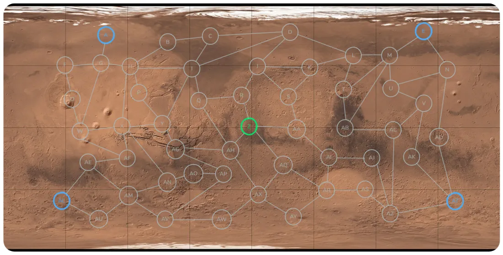
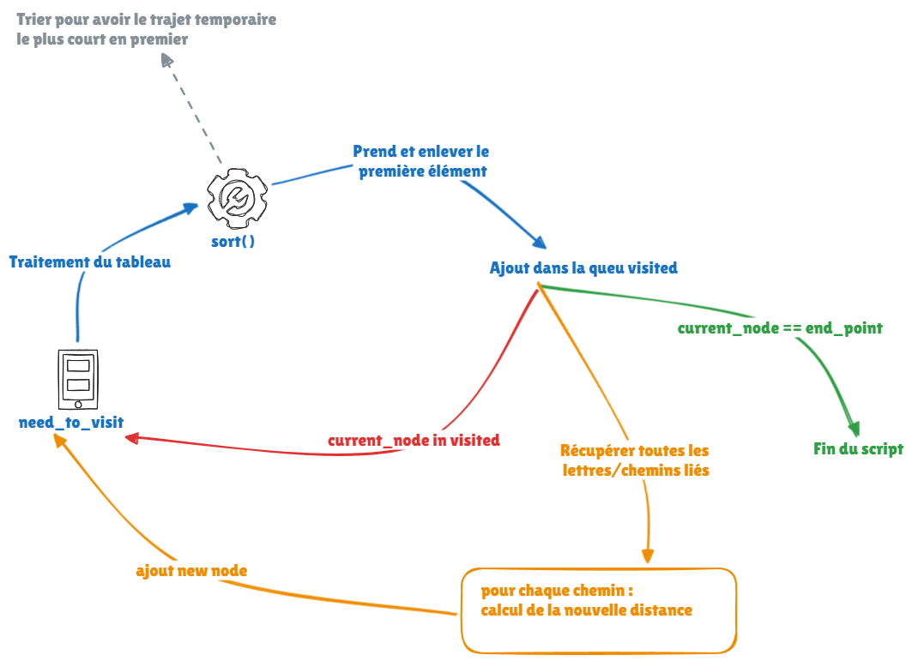

# Mission Spatial Mars

## Description

Vous êtes en mission spatiale sur Mars.
 
Vous avez besoin de trouver le chemin le plus court entre deux points.

## Sujet
Allô Houston, on a un challenge.

Un artefact d'une valeur inestimable a été repéré sur Mars. Comme Bruce Willis et son équipe ne sont pas disponibles, la DCSC (Docstring Challenge Spatial Company) a décidé d'envoyer un robot pour le récupérer. Une équipe de cartographes a fait un relevé topographique du terrain en indiquant les lieux de passage possibles du robot ainsi que les distances entre ces différents points.

Sur la carte, vous avez en bleu les quatre sites d'atterrissage possibles, en vert l'endroit précis où se trouve l'artefact et en blanc les différents points de passage.

Votre mission (si vous l'acceptez) est de déterminer quel site d'atterrissage il faut sélectionner pour atteindre l'artefact en parcourant le moins de distance possible.

## Conditions
- L'affichage se fait via la console.
- Pour calculer le chemin le plus court, vous devez utiliser l'algorithme de Dijkstra.
- Votre algorithme devra prendre en input n'importe quel point de départ et d'arrivé du parcours pour déterminer le chemin le plus court (par exemple, le chemin le plus court entre X et AC).
- N'oubliez pas de gérer les inputs utilisateurs.
- Listing des points et distance : [ici](ressources_mars.py)

## Ressources

- Le fichier contenant les distances de chaque liaison ainsi que la carte de Mars avec les différents checkpoints.

## Réflexions

- une classe qui va me permettre de construire une logique de calcul avec plusieurs fonctions ayant une fonction unique.
  - Une fonction qui va me pré calculer les liens disponibles pour chaque point.
  - Une fonction qui va me permettre de données tous les liens/distances possibles avec un point en entrée.
- ...

**Source : [Challenge DOCSTRING](https://www.docstring.fr/)**